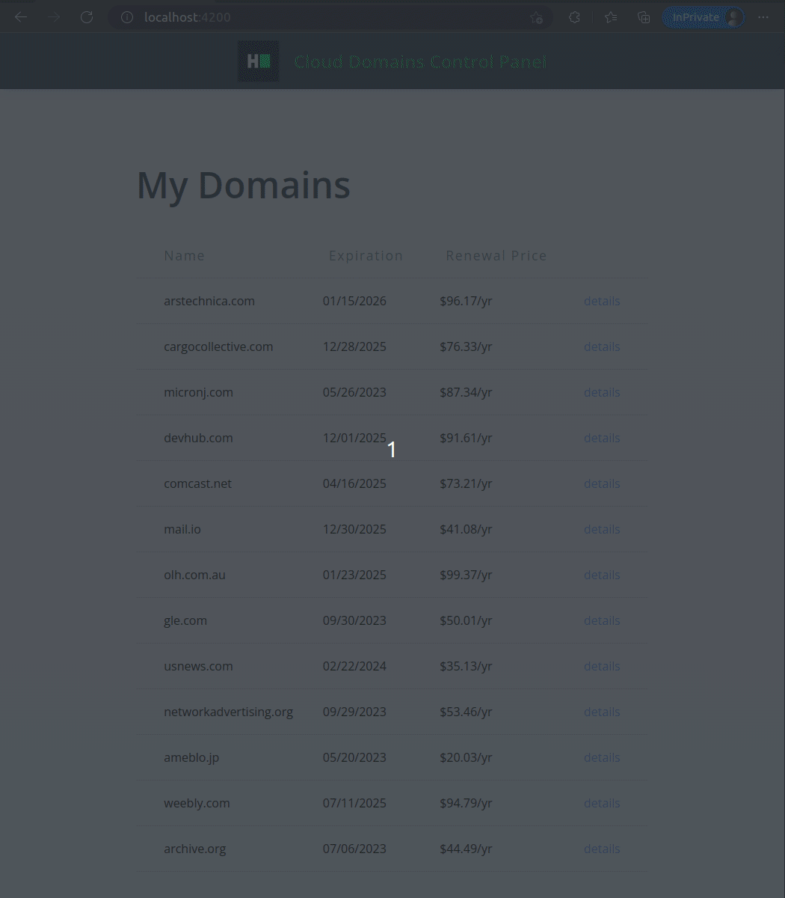

# Angular: Cloud Domains Control Panel

* Score: 75
* Recommended Time: 45 minutes
* Tags:
    * Frontend
    * Medium
    * Angular
* Environment:
    * Node.js: v14.x (LTS, Fermium)
    * Angular: v14.2.10 (LTS)
* Repository: https://github.com/ProblemSetters/1506658-angular-cloud-domains-control-panel
* Link: https://www.hackerrank.com/x/tests/all/1560850/questions/1506658/edit

---

A cloud domain registrar needs functionality in the control panel to display a list of all domains owned by the
customer.

It contains two functional parts that must be combined within this task:

- a domain list that shows all client domains
- domain details that shows additional information about a domain

The user interface design phase is complete, but some functional requirements are missing as specified in the user
stories below.

**User Stories**

1. The user should be able to see a list of all the domains they own in the `/` path. It should include the domain name,
   expiration date, renewal price, and a special administrative column that contains a link to display domain details.

2. When the user clicks the "Details" link, it should display a separate page available under the dynamic
   path `/domain/{domain_id}`.
   This page contains additional information such as the domain auto-renewal status and privacy flags.
   The "Back to List" button should return the user to the list of all domains.

**Notes**

- Use Angular routing in the context of a Single Page Application (SPA) to achieve the goals of this task.
- Values of boolean domain flags should be formatted as string literals `Yes/No` when output.
- The output format for the renewal price value is `$##/yr` where the placeholders are `##` in the order in which they
  appear:
    1. Domain renewal price.
- The user should be returned to the list of domains if they manually entered any incorrect path in the address bar.

**Input Data**

- Refer to the file `src/shared/mock-api-response/domain-list.ts` for all required inputs about the domain list.
